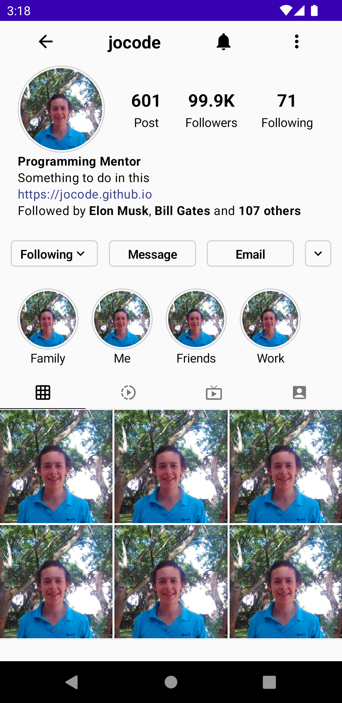

# Instragram Profile UI on Jetpack Compose

This example show how create a UI similar to Instragram Profile



All content is wrapped is a Column for the final screen.

```js
var selectedTabIndex by remember {
    mutableStateOf(0)
}

Column(modifier = Modifier.fillMaxSize()) {
    TopBar(name = "jocode", modifier = Modifier.padding(10.dp))
    Spacer(modifier = Modifier.height(4.dp))
    ProfileSection()
    Spacer(modifier = Modifier.height(25.dp))
    ButtonSection(modifier = Modifier.fillMaxWidth())
    Spacer(modifier = Modifier.height(25.dp))
    HighlightSection(
        highlights = listOf(
            ImageWithText(image = painterResource(id = R.drawable.img), "Family"),
            ImageWithText(image = painterResource(id = R.drawable.img), "Me"),
            ImageWithText(image = painterResource(id = R.drawable.img), "Friends"),
            ImageWithText(image = painterResource(id = R.drawable.img), "Work")
        ),
        modifier = Modifier
            .fillMaxWidth()
            .padding(horizontal = 20.dp)
    )
    Spacer(modifier = Modifier.height(10.dp))
    PostTabView(
        imageWithText = listOf(
            ImageWithText(image = painterResource(id = R.drawable.ic_grid_on), text = "Photos"),
            ImageWithText(
                image = painterResource(id = R.drawable.ic_slow_motion_video),
                text = "Reels"
            ),
            ImageWithText(image = painterResource(id = R.drawable.ic_live_tv), text = "IGTV"),
            ImageWithText(
                image = painterResource(id = R.drawable.ic_account_box),
                text = "Profile"
            ),
        )
    ) {
        selectedTabIndex = it
    }

    when (selectedTabIndex) {
        0 -> PostSection(
            post = listOf(
                painterResource(id = R.drawable.img),
                painterResource(id = R.drawable.img),
                painterResource(id = R.drawable.img),
                painterResource(id = R.drawable.img),
                painterResource(id = R.drawable.img),
                painterResource(id = R.drawable.img),
            ),
            modifier = Modifier.fillMaxWidth()
        )
    }
}
```

*For more detail see* [ProfileScreen.kt](./app/src/main/java/com/example/instragramprofileui/ProfileScreen.kt)